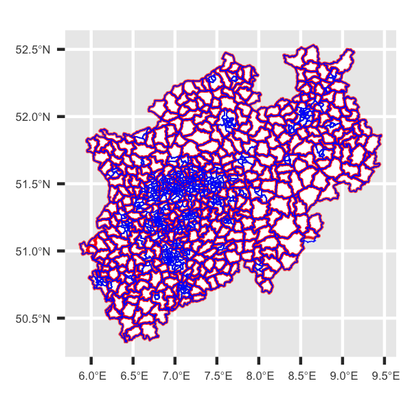

# Matching of German postal codes (PLZ) and municipality identifiers (AGS)

This project provides a map of the intersection of German postal codes (*Postleitzahlen*, PLZ) and 8-digit German municipality identifiers (*Amtliche Gemeindeschlüssel*, AGS) as of 2022 based on open government data. PLZ-AGS combinations can be very helpful units of aggregation for spatial point data because of their granularity: PLZ are very granular in densely populated areas (the major cities in Germany have a large number of different post codes, but in rural areas one post code may span several municipalities), whereas municipality identifiers are much more granular in sparsely populated areas.

*PLZ-AGS combinations in the state of North Rhine-Westphalia (red lines delineate municipalities, blue lines delineate PLZ codes)*

In addition, the intersection of PLZ and AGS areas provides a direct correspondence between PLZ and AGS codes. If one has a PLZ code of a point in space (for example, an establishment of a firm) and wants to obtain the corresponding AGS municipality code, it is easy to match this PLZ to the small set of candidate municipalities.

## Resulting data

This project generates two output data sets:

- `plz-ags.shp`: A shape file of all PLZ-AGS combinations in Germany
- `plz-ags-mapping.csv`: A lightweight CSV table containing the correspondence between PLZ and AGS

You can download the most recent versions of both data sets under the [Releases](https://github.com/joschakrug/plz-ags-matching/releases) tab of this repository.

### Description of variables

|Variable|Description|
|---|---|
|PLZ|(5-digit) postal code|
|AGS|(8-digit) official municipality identifier|
|PLZNAM|Official name of the postal code area|
|ORTNAM|Official name of the municipality|
|ORTTYP|Administrative type of the municipality|
|ORTSTAT|Administrative status of the municipality|

## Data sources

The matching is based on two original data sets:

- The *Verwaltungsgebiete 1 : 250 000 (VG250)* data set as of 1 January 2022, originally provided by the German Federal Office of Cartography and Geodetics (Bundesamt für Kartographie und Geodäsie, BKG) and obtained from [Esri Deutschland](https://opendata-esridech.hub.arcgis.com/datasets/esri-de-content::gemeindegrenzen-2022/about) on 7 August 2025. This data set contains the official borders of German municipalities.
  - The documentation of the original data (in German language) is provided by the German [Geodatenzentrum](https://sg.geodatenzentrum.de/web_public/gdz/dokumentation/deu/vg250_01-01.pdf).
- The *Deutschland: Postleitzahlen* data set provided by [Open.NRW](https://open.nrw/dataset/deutschland-postleitzahlen-ne), obtained on 7 August 2025. It contains the borders of each postal code area in Germany as of 28 December 2022, extracted from OpenStreetMap.

> **Caution:** While the OSM-based PLZ data set is the best openly available data set on postal codes in Germany, it is *not* the authoritative dataset as issued by the Deutsche Post Direkt GmbH. A small number of postal codes may be missing or incorrectly assigned. Always double check information in important cases!
